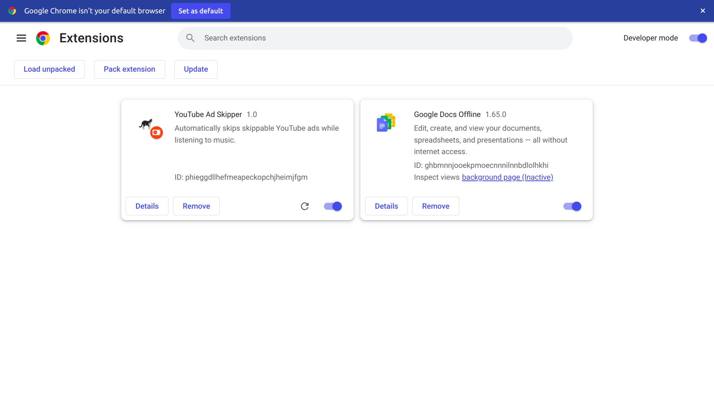

# yt-ad-skipper, skip your YouTube adds 

a simple chrome extension to bring you peace while listening to music or watching any media on Youtube :)) 

## How to use 

- Open Chrome and type this url on the search bar:
  `chrome://extensions/`

- Make sure **Developer mode** is enabled. on the top-right of the header: 

- click on the **Load unpack** button on the top-left section, underneath the Chrome logo.
- select the folder (yt-ad-skipper) and click ok. 

## contribution

Don't hesitate! we are open to all kind of contributions.

Copyright © 2023 Shayan Ghani shayanghani1384@gmail.com
